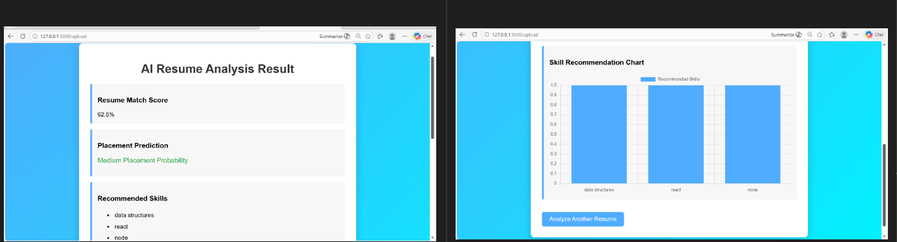
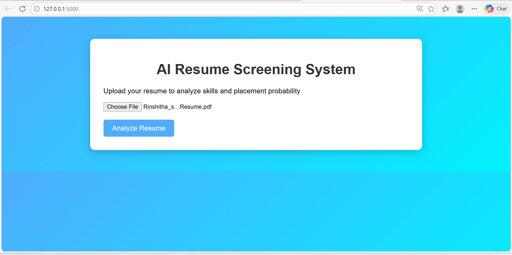

# AI Resume Screening System

## 📌 Project Description
This project is an AI-based Resume Screening System that analyzes resumes, matches skills, and predicts placement probability.

---

## 🚀 Features
- Resume Upload
- Text Extraction
- Skill Matching
- Resume Score Calculation
- Placement Prediction
- Skill Recommendations
- Dashboard Visualization

---

## 🛠️ Technologies Used
- Python
- Flask
- HTML
- CSS
- JavaScript

---

## 📂 Project Structure
- templates → HTML files
- static → CSS & JS
- routes → Flask routes
- models → ML logic
- utils → Helper functions
- dataset → Data for prediction

---

## ⚙️ How It Works
1. User uploads resume
2. Text is extracted
3. Skills are matched
4. Score is calculated
5. Placement prediction is generated
6. Results displayed on dashboard

---

## 📸 Screenshots

## 🔮 Future Enhancements
- Use advanced NLP
- Improve accuracy using ML models
- Add real-time job matching

---

## 👩‍💻 Author
Rinshitha Shirin k
